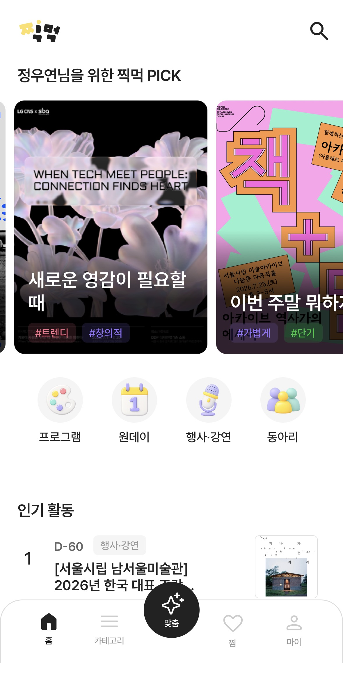
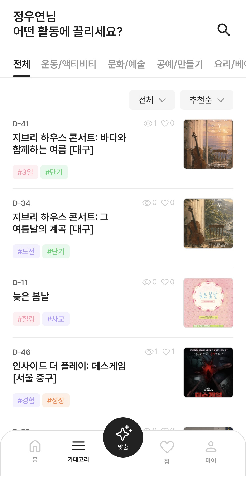
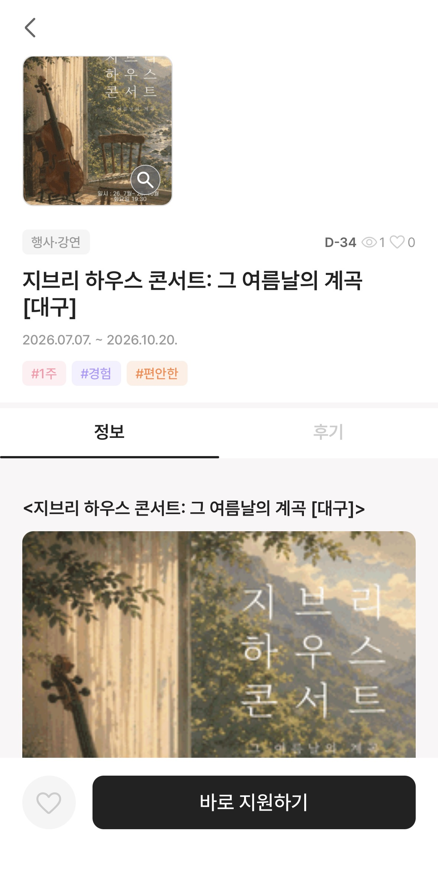
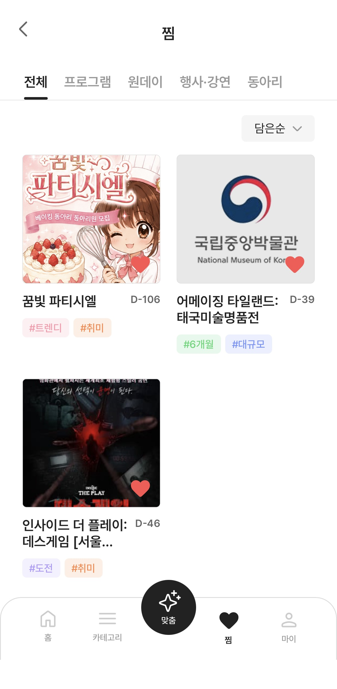
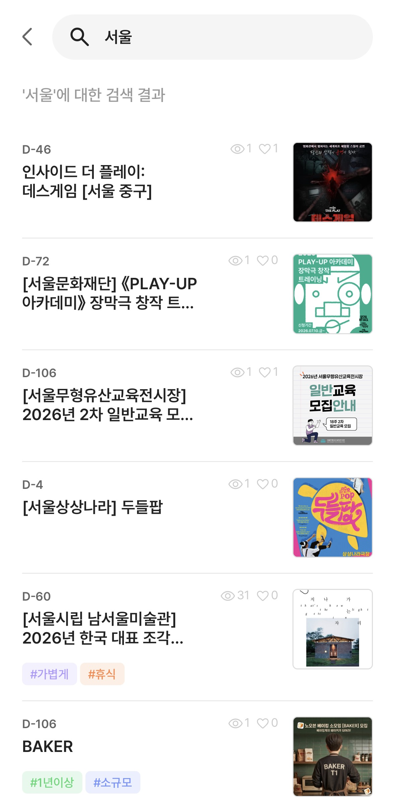

# 찍먹 · JJICK-MEOK Front

> 대학생 연합 IT동아리 "잇타" 팀 프로젝트([원본 레포](https://github.com/JJICK-MEOK/App.git))를 포크하여,
> 포트폴리오 정리를 위해 개인적으로 리팩토링을 추가한 레포입니다.

20대를 위한 맞춤 문화활동 추천 서비스 **찍먹**의 프론트엔드입니다.
취향 온보딩과 스와이프 탐색으로 나에게 맞는 문화활동을 추천하는 React Native 앱입니다.

- 🏠 Organization: https://github.com/JJICK-MEOK
- 🌐 Web (시연용 배포): https://jjick-meok.vercel.app
  > ※ Live Demo는 팀 원본 레포 기준 배포본입니다. 포크 레포에는 포트폴리오용 리팩토링이 추가로 반영되어 있습니다.

### 시연용 QR


> `docs/screenshots/demo-qr.jpg`에 QR 이미지를 넣으면 바로 반영됩니다.

## Screenshots

|                       홈                        |                      카테고리                       |                       상세                        |                      찜(위시리스트)                       |                        검색                         |
| :----------------------------------------------: | :--------------------------------------------------: | :--------------------------------------------------: | :----------------------------------------------------: | :----------------------------------------------------: |
|  |  |  |  |  |

> `docs/screenshots/` 폴더에 위 파일명으로 이미지를 넣으면 표에 바로 반영됩니다. (온보딩 스크린샷을 추가하고 싶으면 `onboarding.jpg`로 넣고 알려주세요.)

## Tech Stack

- **Framework**: React Native & Expo (SDK 57)
- **Navigation**: Expo Router
- **Language**: TypeScript
- **State & Data Fetching**: TanStack Query, Zustand
- **Styling**: styled-components (ThemeProvider) · React Native StyleSheet
- **Component Docs**: Storybook
- **Linting & Formatting**: ESLint, Prettier

## Prerequisites

- Node.js: v20.x.x 이상
- Expo Go App: 아이폰(iOS) 실물 기기에 설치
- Android Studio: 안드로이드 기기가 없을 경우, 에뮬레이터 실행을 위해 설치 필요

## Getting Started

### 1. Install Dependencies

```bash
npm install --legacy-peer-deps
```

### 2. Environment Variables Setup

루트 폴더에 `.env` 파일을 생성하고 필요한 환경 변수를 설정합니다.

### 3. Run the Development Server

```bash
npx expo start -c
```

- **iPhone**: 터미널의 QR 코드를 실물 기기 카메라로 스캔하여 Expo Go에서 실행
- **Android**: Android Studio에서 에뮬레이터를 실행한 후, 터미널에서 `a` 키 입력

### Storybook (컴포넌트 문서)

```bash
npm run storybook
```

### Linting & Formatting

이 프로젝트는 코드 스타일 유지와 오류 방지를 위해 ESLint와 Prettier를 사용합니다.

```bash
npm run fix
```

## 담당 기능

프론트엔드 개발을 담당했으며, 프로젝트 초기 세팅 단계부터 참여했습니다 (폴더 구조 설계, Expo Router 라우팅 구조, Zustand + TanStack Query 기반 상태관리 구조 초기 세팅).

### 담당 화면

- **온보딩**: 관심사/조건 입력 → 단계별 진행, 맞춤 추천을 위한 데이터 수집 (UI 구현)
- **홈 화면**: 추천 활동 리스트, 큐레이션 카드, 배너
- **카테고리 화면**: 프로그램 / 원데이 / 행사·강연 / 동아리 4개 카테고리별 탐색
- **활동 상세 화면**: 장소·비용·시간 등 상세 정보, 신청 연결
- **찜(위시리스트) 화면** + **검색 화면**

### API 연동

홈 · 카테고리 · 상세 · 찜 · 검색 화면의 API 연동을 담당했습니다.

- `getHomeData`, `getDetailData`, `getCategoryPageData`, `getCurationDetailPageData`
- `getFavoritesPageData`, `addFavorite` / `deleteFavorite`
- `searchActivities`

> 온보딩·인증 관련 API 및 소셜 로그인은 다른 프론트엔드 팀원이 담당했습니다.

### 담당 범위 요약

- 화면 UI: 대부분 담당
- API 연동: 홈 / 카테고리 / 상세 / 찜 / 검색
- API 연동에 따른 UI 리팩토링까지 진행

## 이 포크에서 진행한 리팩토링

원본 레포의 기능은 그대로 유지하면서, 아래 항목들을 포트폴리오 정리 목적으로 추가 진행했습니다.

- Expo SDK 54 → 57 업그레이드
- 중복 제거 (DRY): 반복 로직을 훅/컴포넌트/유틸로 추출
- 가독성 · 네이밍 개선: 긴 함수 분리, 불명확한 변수명 정리
- 결합도 낮추기: 서버 응답 값에 흩어져 있던 분기 로직 통합
- 타입 안정성 강화: `any` 제거, 공용 타입 정의 보강
- 아키텍처 개선: 중복 라우트 파일을 동적 라우트로 통합
- 불필요한 코드 제거: 미사용 파일 · export · 의존성 정리
- 에러 처리 일원화: 흩어져 있던 예외 처리를 공통 로직으로 통합
